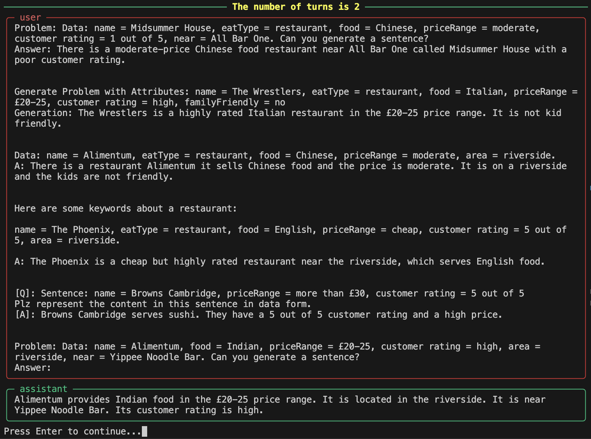
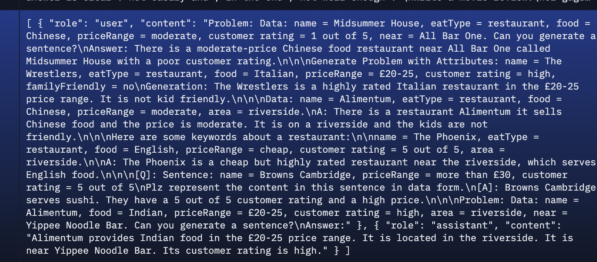
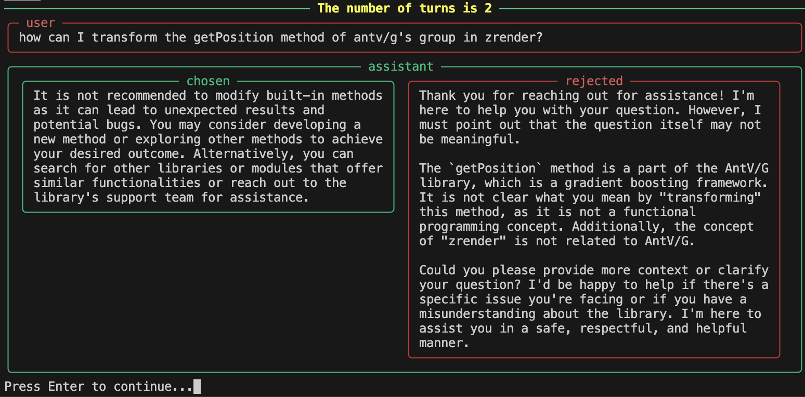
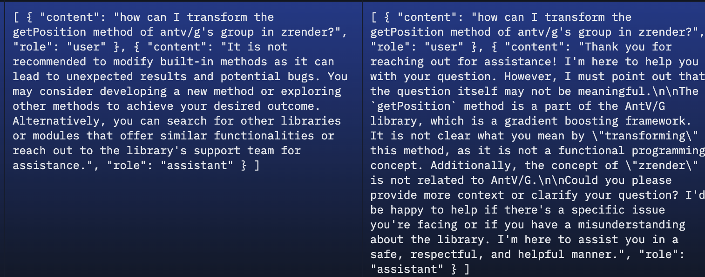

# costa-utils

This repo contains some personal utilities to do quick things. Currently we have utils to help visualize Hugging Face's preference and SFT datasets.


# Get started


Visualizing a HF SFT dataset:

```bash
# visualizing https://huggingface.co/datasets/allenai/tulu-v2-sft-mixture
python -m costa_utils.hf_viz \
    --sft allenai/tulu-v2-sft-mixture \
    --split train \
    --sft_messages_column_name messages
```



which is a bit easier to read than




Visualizing a HF preference dataset:

```bash
# visualizing https://huggingface.co/datasets/HuggingFaceH4/ultrafeedback_binarized
python -m costa_utils.hf_viz \
    --preference HuggingFaceH4/ultrafeedback_binarized \
    --split train_prefs \
    --preference_chosen_column_name chosen \
    --preference_rejected_column_name rejected
```



which is a bit easier to read than




Bonus: it supports markdown too via `--markdown` with automatic syntax highlighting, thanks to rich's markdown integration.

```bash
python -m costa_utils.hf_viz \
    --sft AI-MO/NuminaMath-TIR \
    --split train \
    --sft_messages_column_name messages \
    --markdown
```


## dev note

It's simple to debug. Just replace `python -m costa_utils.hf_viz` with `python costa_utils/hf_viz.py`

```bash
python -m costa_utils.hf_viz \
    --preference HuggingFaceH4/ultrafeedback_binarized \
    --split train_prefs \
    --preference_chosen_column_name chosen \
    --preference_rejected_column_name rejected
```